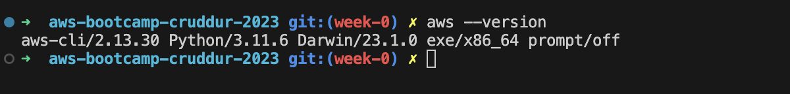

# Week 0 — Billing and Architecture

## Required Homework Tasks

### Install and Verify AWS CLI

I had initially installed AWS CLI locally before the bootcamp.
I installed it following the instructions from [AWS CLI Install Documentation](https://docs.aws.amazon.com/cli/latest/userguide/getting-started-install.html)

I run the `aws --version` command to verify it being installed successfully.

#### Create a Budget
