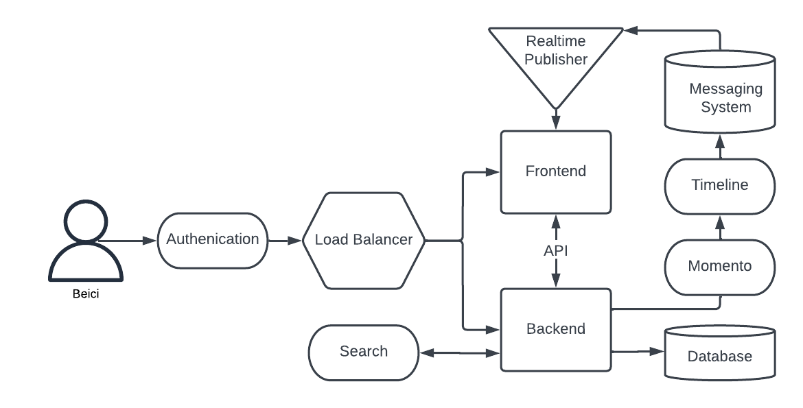
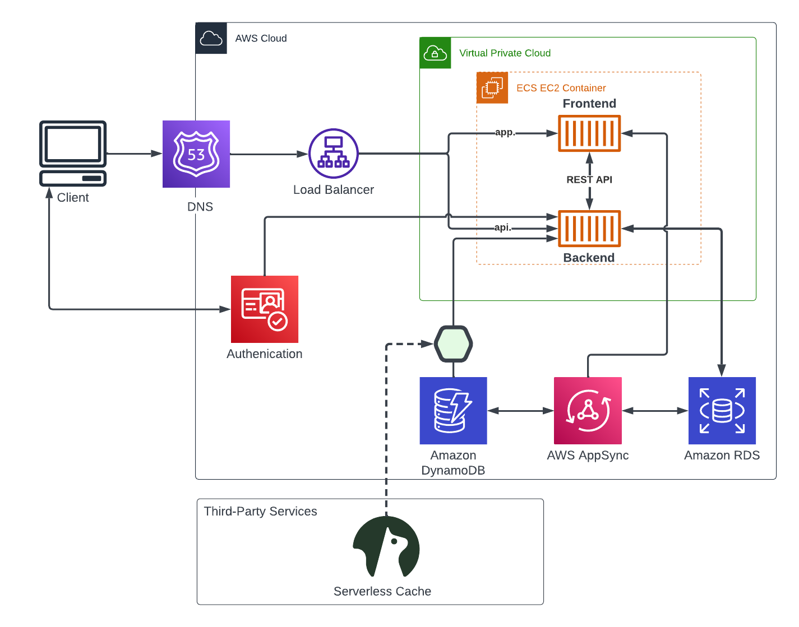

# Week 0 — Billing and Architecture

Table of Contents

- [AWS Setup & Use CLI](#aws-setup--use-of-cli)
- [Billing & Alert Setup](#billing--alert-setup)
- [Architectural Diagrams in Lucid Charts](#architectural-diagrams-in-lucid-charts)

## AWS Setup & Use of CLI

I had initially installed AWS CLI locally before the bootcamp.
I installed it following the instructions from [AWS CLI Install Documentation](https://docs.aws.amazon.com/cli/latest/userguide/getting-started-install.html)

I run the `aws --version` command to verify it being installed successfully.


Sign in as the root user, and do the following setups in the console

- IAM Security: assign MFA to improve security for this account.
- IAM Users: create a new user `jondexter` with `AdministratorAccess` (added to the `Admin` user group).
- IAM Dashboard: create account alias as `jondexter-aws-bootcamp`.

Log out the root user, and sign in as the newly created IAM user to

- IAM Security: since this user has `AdministratorAccess`, it's better to assign MFA to improve security for this account.
- IAM Users: create access key in security credentials using CLI.

In my terminal, I did a sanity check by `aws sts get-caller-identity`. It checked that `UserId`, `Account` and `Arn` to confirm my credentials

## Billing & Alert Setup

### Create a Budget

I created a budget for $1 because i obviosly cannot afford any kind of spend.

I used the aws cli in doing this: [AWS CLI documentation for budget creation](https://docs.aws.amazon.com/cli/latest/reference/budgets/create-budget.html#examples)

I followed the followig steps;

1. I created a [budget.json](aws/json/budget.json) file that describes the budget
1. I added a [notifications-with-subscribers.json](aws/json/notifications-with-subscribers.json) that describes the notification subcribers

In the terminal I run the command below to create the buget while referencing the files above.

Note: I got my account ID using the aws cli command

```sh
aws sts get-caller-identity --query Account --output text
```

### Set Env Vars

Better to store it in env, so I did:

```sh
export ACCOUNT_ID=$(aws sts get-caller-identity --query Account --output text)
```

<!--
We will set these credentials for the current bash terminal
```
export AWS_ACCESS_KEY_ID=""
export AWS_SECRET_ACCESS_KEY=""
export AWS_DEFAULT_REGION=us-east-1
``` -->

Then i can just reference it as $ACCOUNT_ID

```sh
aws budgets create-budget \
    --account-id $ACCOUNT_ID \
    --budget file://aws/json/budget.json \
    --notifications-with-subscribers file://aws/json/notifications-with-subscribers.json
```

I run the command and went to the management console to check the bugdget


Now next step is to configure sns for alarms to work

### Create SNS Topic

- We need an SNS topic before we create an alarm.
- The SNS topic is what will delivery us an alert when we get overbilled
- [aws sns create-topic](https://docs.aws.amazon.com/cli/latest/reference/sns/create-topic.html)

We'll create a SNS Topic

```sh
aws sns create-topic --name billing-alarm
```

which will return a TopicARN

We'll create a subscription supply the TopicARN and our Email

```sh
aws sns subscribe \
    --topic-arn TopicARN \
    --protocol email \
    --notification-endpoint your@email.com
```

Check your email and confirm the subscription

#### Create Alarm

- [aws cloudwatch put-metric-alarm](https://docs.aws.amazon.com/cli/latest/reference/cloudwatch/put-metric-alarm.html)
- [Create an Alarm via AWS CLI](https://aws.amazon.com/premiumsupport/knowledge-center/cloudwatch-estimatedcharges-alarm/)
- We need to update the configuration json script with the TopicARN we generated earlier
- We are just a json file because --metrics is is required for expressions and so its easier to us a JSON file.

```sh
aws cloudwatch put-metric-alarm --cli-input-json file://aws/json/alarm-config.json
```

## Architectural Diagrams in Lucid Charts

1. Conceptual Diagram

The conceptual digram can be accessed with the link [AWS Bootcamp Project Conceptual Diagram](https://lucid.app/lucidchart/63a9970c-b010-4e03-8dd5-6051f7a0133b/edit?viewport_loc=-119%2C-175%2C1579%2C903%2Cvi_xnvX6lTaw&invitationId=inv_478f90f3-2991-4dad-a10f-471e7e5825b9). Screenshot of the conceptual diagram is attached below.



2. Logical Architectural Diagram

Its available via the link: [AWS Bootcamp Project Logical Architectural Diagram](https://lucid.app/lucidchart/be8a8049-f889-46c4-83b9-cd52f06a9445/edit?viewport_loc=-311%2C177%2C2037%2C964%2C0_0&invitationId=inv_9600c9fb-e606-403a-888a-9fe299d682da). Screenshot of the logical architectural diagram is attached below.


