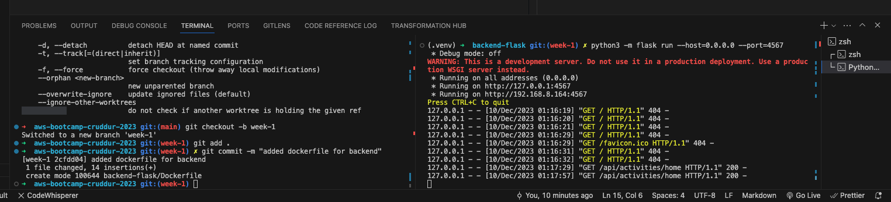

# Week 1 — App Containerization

- [Get the apps running locally](#get-the-apps-running-locally)
- [Containerize backend and frontend](#containerize-backend-and-frontend)
- [Add notification endpoint and React page](#add-notification-endpoint-and-react-page)
- [Compose multiple containers with DynamoDB Local and Postgres](#compose-multiple-containers-with-dynamodb-local-and-postgres)
- [References](#references)

## Get the apps running locally

### 1 . Running the Flask app locally

For the backend, at the root of the project, i run the following commands to run the flask app locally on port 4567.
I created a virtual env to for the backend app

```sh
cd backend-flask
python3 -m venv .venv
source .venv/bin/activate
pip3 install -r requirements.txt
export FRONTEND_URL="*"
export BACKEND_URL="*"
python3 -m flask run --host=0.0.0.0 --port=4567
```

I got the following results in my terminal


And i went ahead to confirm the api from my browser using the `http://localhost:4567/api/activities/home`


### 2 . Running the React app locally

For the frontend, at the root of the project, i run the following commands

```sh
cd frontend-react-js
npm i
```

## Containerize backend and frontend

I created a Dockerfile for the flask app; `backend-flask/Dockerfile` ([code](https://github.com/johnkdunyo/aws-bootcamp-cruddur-2023/blob/week-1/backend-flask/Dockerfile)). At the root, I run the commands below to build a docker image and run it.

```sh
docker build -t  backend-flask ./backend-flask
docker run --rm -p 4567:4567 -it -e FRONTEND_URL='*' -e BACKEND_URL='*' backend-flask
```

We can send curl to test the server, which returns json as the response in the previous section:

```sh
curl -X GET http://localhost:4567/api/activities/home -H "Accept: application/json" -H "Content-Type: application/json"
```

I created a Dockerfile as `frontend-react-js/Dockerfile` ([code](https://github.com/johnkdunyo/aws-bootcamp-cruddur-2023/blob/week-1/frontend-react-js/Dockerfile)). At the root, I run the following commands to build and run the container

```sh
docker build -t frontend-react-js ./frontend-react-js
docker run --rm -p 3000:3000 -d frontend-react-js
```

## Add notification endpoint and React page

### 1. Flask App Notifications

I modified the following files as shown in the commits attached to them:

- `backend-flask/openapi-3.0.yml`: add `/api/activities/notifications` in `paths` (take ` /api/activities/home` as reference) [commit](https://github.com/johnkdunyo/aws-bootcamp-cruddur-2023/commit/5e378e527ca5e18e04e6f91b395c0389323c0481)
- `backend-flask/app.py`: add the route for `/api/activities/notifications` and define the function for `data_notifications`, which uses the class `NotificationsActivities` imported from `services.notifications_activities` [commit](https://github.com/johnkdunyo/aws-bootcamp-cruddur-2023/commit/a56563fdf82efb77c132c9b393140a6fc9daf629)
- `backend-flask/services/notifications_activities.py`: define the class `NotificationsActivities` (take `home_activities.py` as reference) [commit](https://github.com/johnkdunyo/aws-bootcamp-cruddur-2023/commit/fddccd62a5e6385cdf88add72fe6b0f5b351be7e)

### 2. Flask App Notifications

For the frontend, as seen in [this commit](https://github.com/johnkdunyo/aws-bootcamp-cruddur-2023/commit/f5a4eda7e56b02b99998c1bcdd11280d7c977ace), modify the following files:

- `frontend-react-js/src/App.js`: add path and element for notifications in the router
- `frontend-react-js/src/pages/NotificationsFeedPage.js`: create js file for the notification page (take `HomeFeedPage.js` as reference)
- `frontend-react-js/src/pages/NotificationsFeedPage.css`: create an empty css file

## Compose multiple containers with DynamoDB Local and Postgres

Create `docker-compose.yml` at the root of the project ([code](https://github.com/johnkdunyo/aws-bootcamp-cruddur-2023/blob/week-1/docker-compose.yml)). We are going to use Postgres and DynamoDB local in future labs. We can bring them in as containers and reference them externally.

Now run `docker compose up` and open the link of `3000` in the browser, sign up and sign in as a new user (verified with the code of `1234` saved in the cookies). Now in the "Notifications", the application is shown as the screenshot below.


## References

- Good Article for Debugging Connection Refused ([link](https://pythonspeed.com/articles/docker-connection-refused/))
- CORS in a Flask API([link](https://medium.com/@mterrano1/cors-in-a-flask-api-38051388f8cc))
- Example of using DynamoDB local ([link](https://github.com/100DaysOfCloud/challenge-dynamodb-local))
